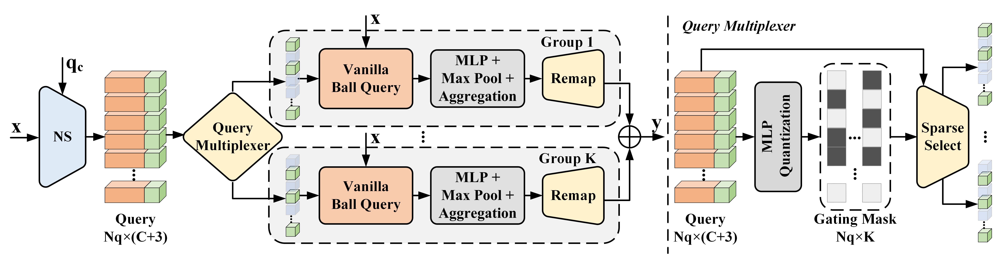
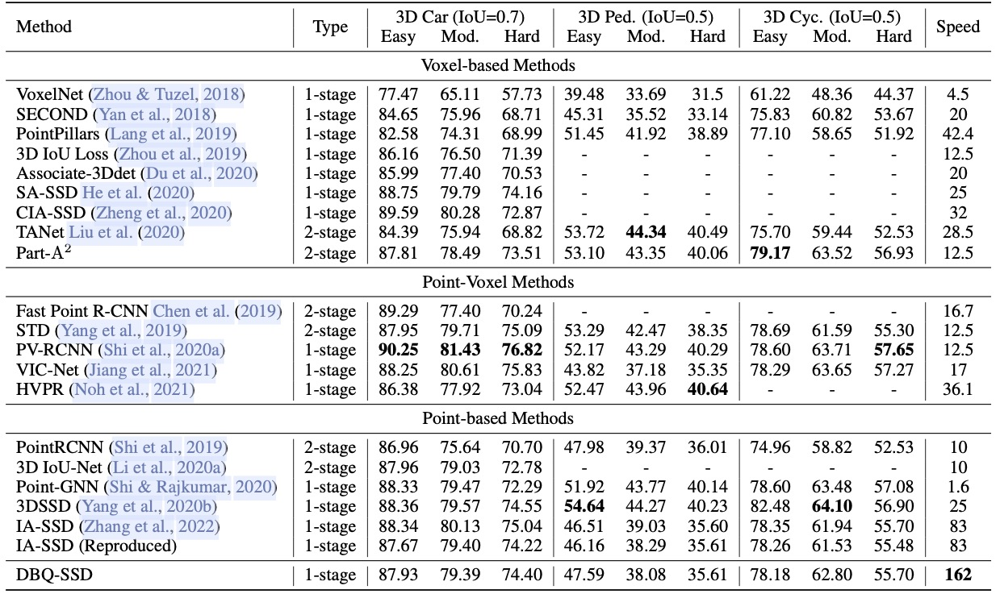
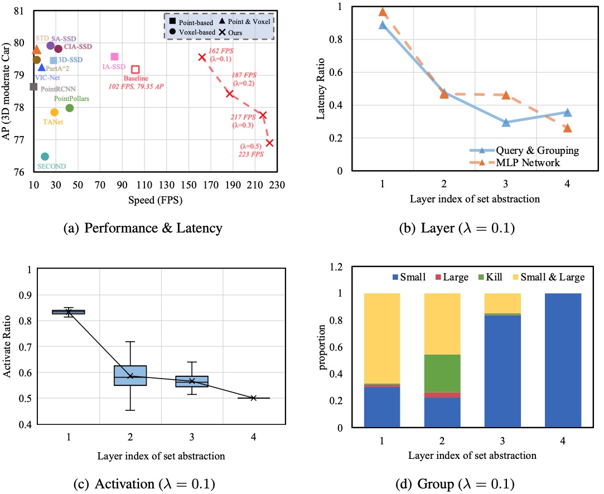
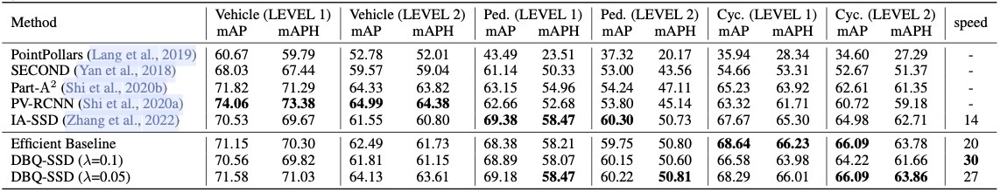
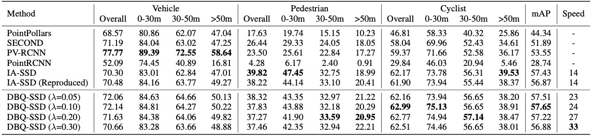
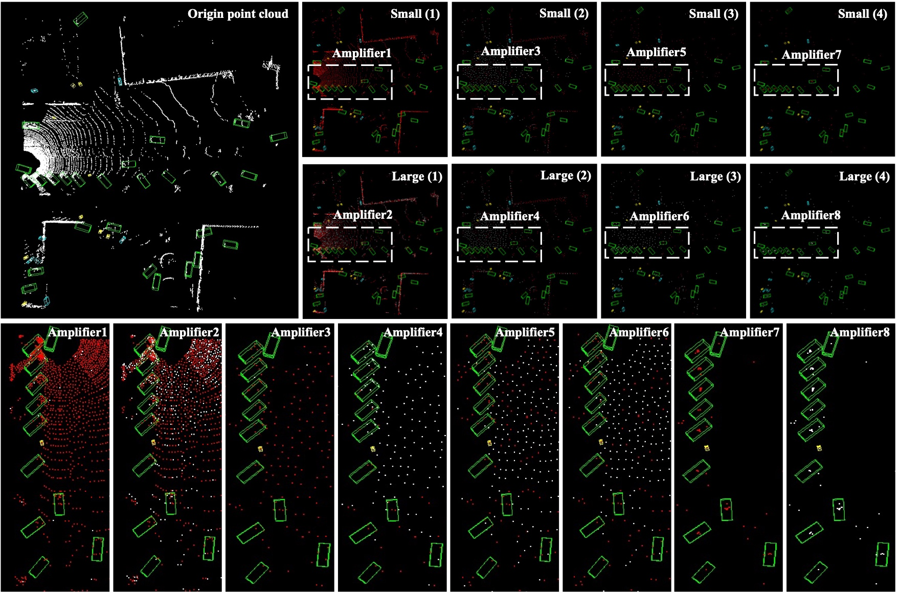
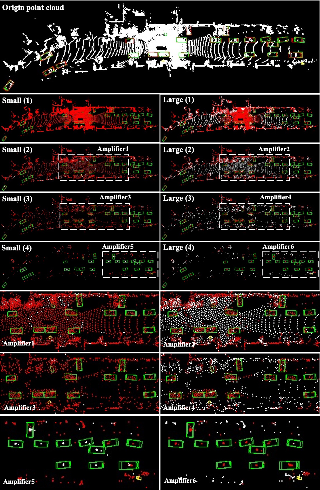
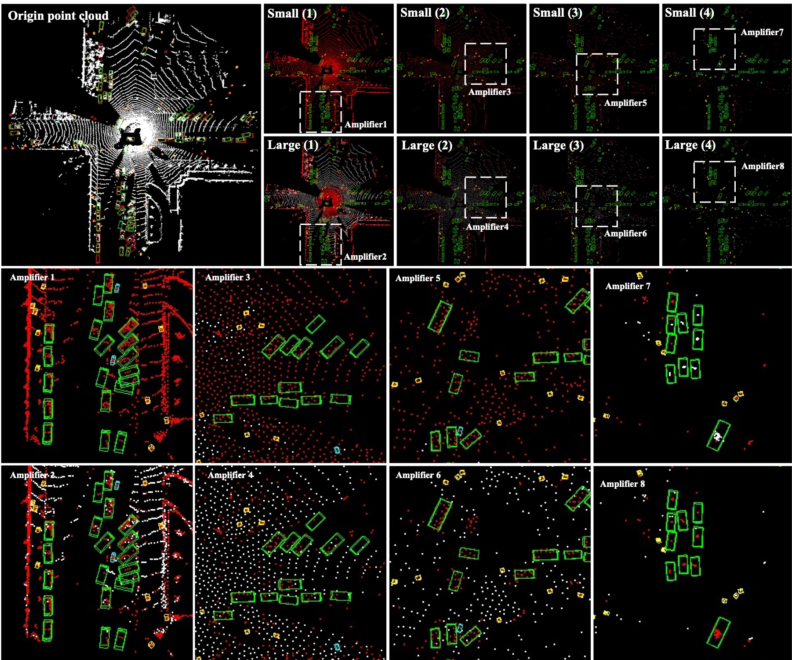

# DBQ-SSD: Dynamic Ball Query for Efficient 3D Object Detection (ICLR 2023)

**DBQ-SSD: Dynamic Ball Query for Efficient 3D Object Detection** <br />
[Jinrong Yang](https://scholar.google.com.hk/citations?user=8Of_NYQAAAAJ&hl=zh-CN), [Lin Song](https://scholar.google.com.hk/citations?user=6Ra2TgQAAAAJ&hl=zh-CN), [Songtao Liu](https://scholar.google.com.hk/citations?user=xY9qK1QAAAAJ&hl=zh-CN), Weixin Mao, [Zeming Li](http://www.zemingli.com/), Xiaoping Li*, Hongbin Sun*, [Jian Sun](https://scholar.google.com.hk/citations?user=ALVSZAYAAAAJ&hl=zh-CN&oi=sra), Nanning Zheng<br />

**[[Paper](https://openreview.net/pdf?id=ZccFLU-Yk65)]** <br />

<p align="center">  </p>


## Getting Started
### Installation

a. Clone this repository
```shell
git clone https://github.com/yancie-yjr/DBQ-SSD.git && cd DBQ-SSD
```
b. Configure the environment

We have tested this project with the following environments:
* Ubuntu18.04/20.04
* Python = 3.8.10
* PyTorch = 1.10.2
* CUDA = 11.1
* CMake >= 3.13
* spconv = 1.0 
    ```shell
    # install spconv=1.0 library
    git clone https://github.com/yifanzhang713/spconv1.0.git
    cd spconv1.0
    sudo apt-get install libboostall-dev
    python setup.py bdist_wheel
    pip install ./dist/spconv-1.0*   # wheel file name may be different
    cd ..
    ```

c. Install `pcdet` toolbox.
```shell
pip install -r requirements.txt
python setup.py develop
```

d. Prepare the datasets. 

Download the official KITTI with [road planes](https://drive.google.com/file/d/1d5mq0RXRnvHPVeKx6Q612z0YRO1t2wAp/view?usp=sharing) and Waymo datasets, then organize the unzipped files as follows:
```
DBQ-SSD
├── data
│   ├── kitti
│   │   ├── ImageSets
│   │   ├── training
│   │   │   ├──calib & velodyne & label_2 & image_2 & (optional: planes)
│   │   ├── testing
│   │   │   ├──calib & velodyne & image_2
│   ├── waymo
│   │   │── ImageSets
│   │   │── raw_data
│   │   │   │── segment-xxxxxxxx.tfrecord
|   |   |   |── ...
|   |   |── waymo_processed_data_v0_5_0
│   │   │   │── segment-xxxxxxxx/
|   |   |   |── ...
│   │   │── waymo_processed_data_v0_5_0_gt_database_train_sampled_1/
│   │   │── waymo_processed_data_v0_5_0_waymo_dbinfos_train_sampled_1.pkl
│   │   │── waymo_processed_data_v0_5_0_gt_database_train_sampled_1_global.npy (optional)
│   │   │── waymo_processed_data_v0_5_0_infos_train.pkl (optional)
│   │   │── waymo_processed_data_v0_5_0_infos_val.pkl (optional)
├── pcdet
├── tools
```
Generate the data infos by running the following commands:
```python 
# KITTI dataset
python -m pcdet.datasets.kitti.kitti_dataset create_kitti_infos tools/cfgs/dataset_configs/kitti_dataset.yaml

# Waymo dataset
python -m pcdet.datasets.waymo.waymo_dataset --func create_waymo_infos \
    --cfg_file tools/cfgs/dataset_configs/waymo_dataset.yaml
```


### Quick Inference
We provide the pre-trained weight file so you can just run with that:
```shell
cd tools 

# To reduce the pressure on the CPU during preprocessing, a suitable batchsize is recommended, e.g. 16. (Over 5 batches per second on RTX2080Ti)
OMP_NUM_THREADS=1 python tools/test.py --cfg_file tools/cfgs/kitti_models/DBQ-SSD.yaml --batch_size 16 --workers 8 \
    --ckpt DBQ-SSD.pth --set MODEL.POST_PROCESSING.RECALL_MODE 'speed' 
```


### Training
The configuration files are in ```tools/cfgs/kitti_models/DBQ-SSD.yaml```, and the training scripts are in ```tools/scripts```.

Train with single or multiple GPUs: (e.g., KITTI dataset)
```shell
python tools/train.py --cfg_file tools/cfgs/kitti_models/DBQ-SSD.yaml

# or 

sh tools/scripts/dist_train.sh ${NUM_GPUS} --cfg_file tools/cfgs/kitti_models/DBQ-SSD.yaml
```


### Evaluation

Evaluate with single or multiple GPUs: (e.g., KITTI dataset)
```shell
python tools/test.py --cfg_file tools/cfgs/kitti_models/DBQ-SSD.yaml  --batch_size ${BATCH_SIZE} --ckpt ${PTH_FILE}

# or

sh tools/scripts/dist_test.sh ${NUM_GPUS} \
    --cfg_file tools/cfgs/kitti_models/DBQ-SSD.yaml --batch_size ${BATCH_SIZE} --ckpt ${PTH_FILE}
```

### Experimental results

#### KITTI dataset

Experiment results of different approaches on KITTI dataset (*test* set):
<p align="center">  </p>

Quantitative results of different approaches on KITTI dataset (*test* set):
<p align="center">  </p>

Experiment results of different approaches on Waymo dataset (*validation* set):
<p align="center">  </p>

Experiment results of different approaches on ONCE dataset (*validation* set):
<p align="center">  </p>

Visualization results of our DBQ-SSD on KITTI scene:
<p align="center">  </p>

Visualization results of our DBQ-SSD on Waymo scene:
<p align="center">  </p>
<p align="center">  </p>

## Citation 
If you find this project useful in your research, please consider citing:

```
@inproceedings{dbqssd,
  title={Dbq-ssd: Dynamic Ball Query for Efficient 3D Object Detection},
  author={Yang, Jinrong and Song, Lin and Liu, Songtao and Mao, Weixin and Li, Zeming and Li, Xiaoping and Sun, Hongbin and Sun, Jian and Zheng, Nanning},
  booktitle={International Conference on Learning Representations},
  year={2023}
}
```

## Acknowledgement
-  This work is built upon the `OpenPCDet` (version `0.5`) an open source toolbox for LiDAR-based 3D scene perception. Please refer to the [official github repository](https://github.com/open-mmlab/OpenPCDet) for more information.
-  This work is also refer to the [IA-SSD](https://github.com/yifanzhang713/IA-SSD), the baseline model of our method.


## License

This project is released under the [Apache 2.0 license](LICENSE).

